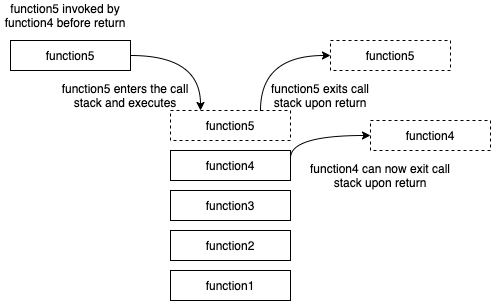

# Object.keys, Object.values, and Object.entries

## Understanding The Javascript Call Stack

Source *(article)*: [The JavaScript Call Stack - What It Is and Why It's Necessary](https://www.freecodecamp.org/news/understanding-the-javascript-call-stack-861e41ae61d4/)

* What is a ‘call’?
  * A call is a function invocation. It marks the beginning of function execution.
* How many ‘calls’ can happen at once?
  * One. This why the Javascript Engine call stack is called 'single stack'
* What does LIFO mean?
  * Last In First Out. This means that the last function to be invoked and added to the call stack will be the first function to be removed from from the call stack upon return.
* Draw an example of a call stack and the functions that would need to be invoked to generate that call stack.
  * 
* What causes a Stack Overflow?
  * A stack overflow is caused by a recursive function that calls itself repeatedly without an exit point. The call stack essentially gets caught in an infinite loop and exceeds the maximum stack limit of the browser.

## JavaScript Error Messages

Source *(article)*: [JavaScript error messages && debugging](https://codeburst.io/javascript-error-messages-debugging-d23f84f0ae7c)

* What is a ‘reference error’?
  * Reference errors occur when trying to access a variable does does not exist.
* What is a ‘syntax error’?
  * A syntax error occurs when the engine encounters something that cannot be parsed due to syntax.
* What is a ‘range error’?
  * Range errors most commonly show up when trying to access a part of data length that is outside of it's length. Lengths also cannot be negative and will throw a range error.
* What is a ‘type error’?
  * A type error throws when trying to use or access data of an incompatible type. This would incude situations like calling an Object.prototype method on a string.
* What is a breakpoint?
  * A breakpoint is a marker that will stop execution of JS upon reaching the line. Breakpoints can also be updated to include conditions that will only stop the code when met.
* What does the word ‘debugger’ do in your code?
  * Adding 'debugger' to code will add a breakpoint.

## Things I want to know more about

I've normally been debugging through console logs, but adding breakpoints seems like a useful tool that I'm not accustomed to using. I'd like to know more about how break points can be used to effectively diagnose problems, and I imagine it's something that will just come with practice and experience.
